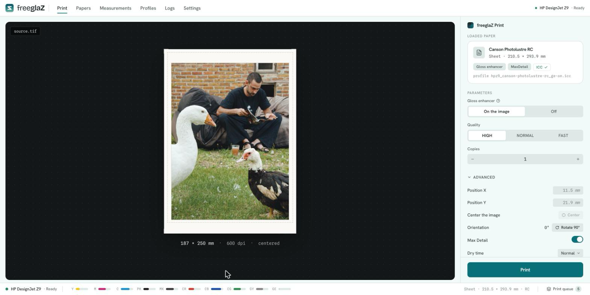
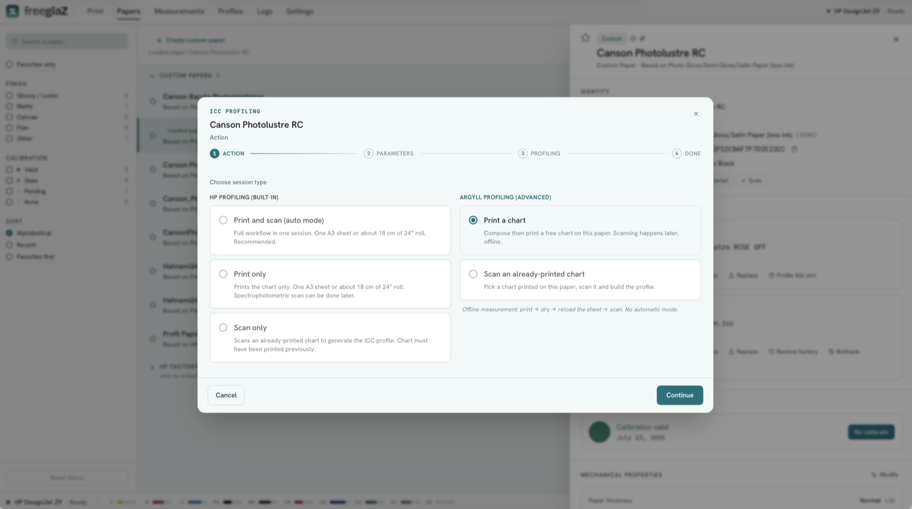
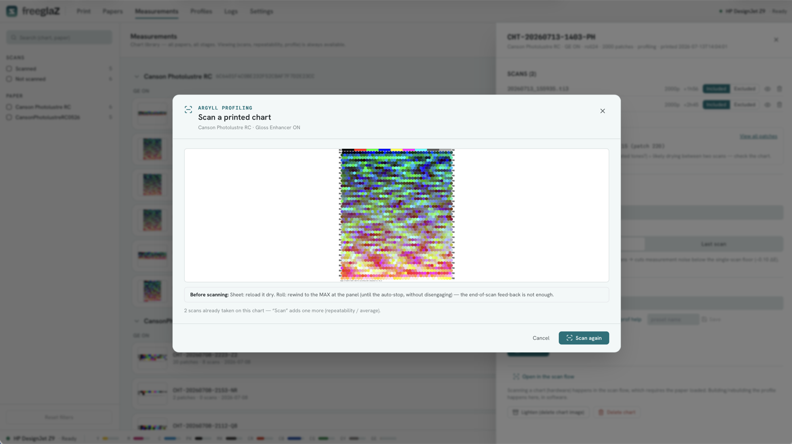

# freeglaz

An open toolkit that drives an HP DesignJet Z9 for printing and ICC color
profiling (native and custom, the latter via ArgyllCMS), without the vendor's
proprietary utilities.

*glaz — the Breton word for the blue-green of sea and sky, one color where other
languages see two.*

## Status: Beta

freeglaz is in active beta. Feedback is welcome:

- **Bugs / something broken** → open an [Issue](../../issues).
- **Usage questions, friction, ideas** → start a [Discussion](../../discussions).

## What freeglaz does

- **OS- and driver-independent pipeline** — freeglaz drives the Z9 over its
  network interfaces without a vendor driver; color management is not affected
  by OS or driver updates.
- **Gloss Enhancer restricted to the image area** — the gloss enhancer is
  applied to the image area, not the whole sheet.
- **Profiling via ArgyllCMS** — see the [Profiling](#profiling) section below.

## Color management: no conversion

freeglaz applies colorimetric non-interference. Between the input file and the
printer's rendering engine — the APPE (Adobe PDF Print Engine), the RIP embedded
in the Z9 that interprets the PDF and drives the inks — freeglaz inserts no color
conversion:

- the embedded ICC profile is checked for presence only; it is never modified,
  normalized or replaced;
- the file is carried byte for byte; the same ICC profile is reused as-is in the
  PDF/X-4 (as the image color space and as the OutputIntent);
- no perceptual rendering, black point compensation or rendering-intent change is
  applied.

All color work belongs upstream, in editing: rendering intent, black point
compensation, and the conversion to the paper profile. These are editing
decisions, made in soft-proof against the paper profile. They are outside
freeglaz's scope; freeglaz prints the values it is given.

As a counterpart to this non-interference, freeglaz compares the ICC profile
embedded in the input file with the profile of the paper active in the printer,
and reports a warning if they differ. This is a warning, not a block: nothing is
imposed and nothing is corrected, but a file that is not in the paper's color
space is flagged before printing.

## Hardware

freeglaz drives an HP DesignJet Z9 over its network interfaces. Tested on a
24-inch model (single roll). Other configurations are untested; see Limitations.

## Profiling

freeglaz supports two profiling paths.

The first triggers the printer's native profiling: the firmware generates its
chart, prints it, measures it with the embedded spectrophotometer, and computes
and installs the ICC profile. freeglaz drives this process — including on Linux,
where the vendor utility is not available.

The second is an open profiling path. Patch sets are defined with ArgyllCMS
(targen) and laid out by freeglaz as a honeycomb chart. The chart is printed
through the freeglaz pipeline and measured by the Z9's embedded
spectrophotometer; the ICC profile is computed by ArgyllCMS (colprof). On this
path the firmware performs no color computation: chart layout is done by
freeglaz, everything else by ArgyllCMS.

## Input

Input: an RGB TIFF, 8- or 16-bit per channel, with an embedded ICC profile,
already converted to the target paper profile. Other formats and color spaces
are rejected by the web app; the CLI is less restrictive. A 16-bit file is
preserved and passed as-is to the APPE.

freeglaz expects a final, flattened image. Multi-page TIFFs are rejected. An
alpha channel, if present, is ignored (transparency is not handled); only the
RGB channels are used.

## Status

freeglaz is functional on the printing path and under active development. Details
of what is and isn't covered are in the Limitations section.

## Components

CLI `freeglaz` (Python) and an optional web app (FastAPI + React, browser-served,
with an optional native desktop window). The core logic is in `lib/z9_client/`;
the web app is an HTTP layer over it and does not duplicate the printing or
profiling logic.

## Installation

A release install needs no Node or build step; building from source additionally
needs Node.js 22 to build the web UI. Guides:

- **macOS — the app (easiest, Apple Silicon)** — [`Docs/INSTALL_app_macos.md`](Docs/INSTALL_app_macos.md): download the `.dmg`, drag to Applications, no Terminal.
- macOS, from a release (CLI / browser, or Intel) — [`Docs/INSTALL_tarball_macos.md`](Docs/INSTALL_tarball_macos.md)
- Linux, from a release — [`Docs/INSTALL_tarball_linux.md`](Docs/INSTALL_tarball_linux.md)
- Windows, from a release (experimental) — [`Docs/INSTALL_tarball_windows.md`](Docs/INSTALL_tarball_windows.md)
- macOS, from source (contributors) — [`Docs/INSTALL_source_macos.md`](Docs/INSTALL_source_macos.md)
- Linux, from source (contributors) — [`Docs/INSTALL_source_linux.md`](Docs/INSTALL_source_linux.md)

The printer address is configured in the app on first launch (Settings →
Printers); no configuration file is required for normal use. A `.env` is a
development override. The backend listens on `127.0.0.1`.

## Usage

The **[User Guide](Docs/USER_GUIDE.md)** covers day-to-day use: printing, papers,
color calibration, and building custom ICC profiles.

## Platforms

- macOS — tested.
- Linux — validated (Debian/Mint, Fedora).
- Windows — experimental: a launcher and an install guide are provided, but the
  build has not yet been validated on hardware. Feedback welcome.

## Dependency

ArgyllCMS is required and never bundled. It is a system dependency installed
separately (Homebrew on macOS, the distribution's package manager on Linux); see
the install guides.

## License

GPL-3.0-or-later. See the [`LICENSE`](LICENSE) file for the full text.

## Limitations

freeglaz does not cover every capability of the printer. Known limitations:

- **Margins** — only the `normal` (bordered) mode is supported. Borderless
  (`nomargins`) is not covered yet.
- **Grayscale** — the Z9's native grayscale mode (black and gray inks) is not
  tested. Grayscale-profiled input is rejected; input must be RGB.
- **Single roll** — freeglaz addresses a single-roll configuration. Dual Roll is
  not handled.
- **Tested hardware** — freeglaz has been tested on a 24-inch Z9 (single roll,
  with the Gloss Enhancer kit). The 44-inch model, in either single-roll or Dual
  Roll configuration, is untested.
- **Gloss Enhancer kit** — the Gloss Enhancer is an optional hardware kit
  (firmware-enabled). freeglaz has only been tested on a machine fitted with the
  kit; behaviour on a Z9 without it is not validated. The Gloss Enhancer control
  is offered only for papers the firmware reports as capable.
- **Input formats** — the web app accepts RGB TIFF only (8- or 16-bit, embedded
  ICC). CMYK, grayscale, PDF, multi-page, floating-point and BigTIFF (over 4 GB)
  files are rejected; an alpha channel is ignored, not rejected. The CLI is less
  restrictive.
- **No nesting** — laying out multiple images on a single sheet is not supported
  (incompatible with the image-area Gloss Enhancer mechanism).
- **Profiling chart layout** — only one chart layout is produced and measured:
  the freeglaz honeycomb. The patch content is not constrained (defined via
  ArgyllCMS/targen), but the physical layout is fixed to the honeycomb.
- **Platforms** — Windows support is experimental: a launcher and install guide
  are provided ([`Docs/INSTALL_tarball_windows.md`](Docs/INSTALL_tarball_windows.md)),
  but the build has not yet been validated on hardware.

Contributions in these areas are welcome.

## Support

freeglaz is free and open source, built and maintained by one person. If it is
useful to you, you can help fund its development and the hardware it depends on —
ink, paper, and test media.

It is entirely **pay what you want**: give whatever fits your means and feels fair
to you — one-time or monthly, from the price of a coffee upward.

**[☕ ko-fi.com/freeglaz](https://ko-fi.com/freeglaz)**

And please don't forget the projects freeglaz is built on — above all
[ArgyllCMS](https://www.argyllcms.com/), the color engine behind the profiling.
Supporting them matters just as much.

## Credits

freeglaz was developed with Anthropic's Claude: Claude (design, strategy,
technical briefs), Claude Code (implementation), and Claude Design (interface
mockups). Domain expertise, hardware testing on the actual printer, and all
design and validation decisions are the author's.

## Legal

freeglaz distributes no HP code and no other proprietary code.

freeglaz is not affiliated with HP. HP and DesignJet are trademarks of their
respective owners.
